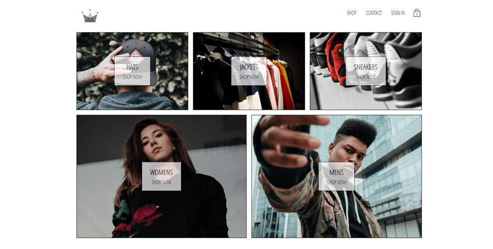
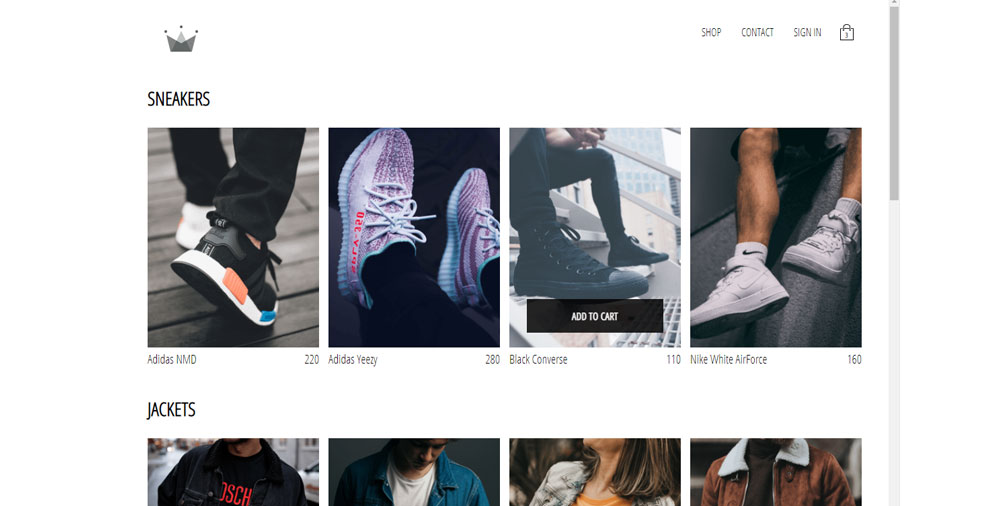

# ECOM PROJECT
React ECOM project that used routing, redux, stripe payment, styled components, release, and many other JavaScript codes to create a smooth and fast loading ECOM site.

## Main Page 👇
The main page has the categories and some nice rollover elements.

## Collections Page 👇
Each category goes to its own page.

## Cart Dropdown 👇
The cart has a shopping icon at top left and drops down to show items in cart when you click on shopping icon.

## Google sign in authentication 👇
The sign in page is set up with google auth so you can sign in with your google account.

## Stripe Pay 👇
You can pay with credit cards as the app is set up with stripe payments. Use the test credit card nuber to test it out.
You can also add and remove items in cart and the total will reflect that.

## Live Site
You can see the site live by clicking <a href="https://crown-clothingv2.herokuapp.com/">Here</a>
